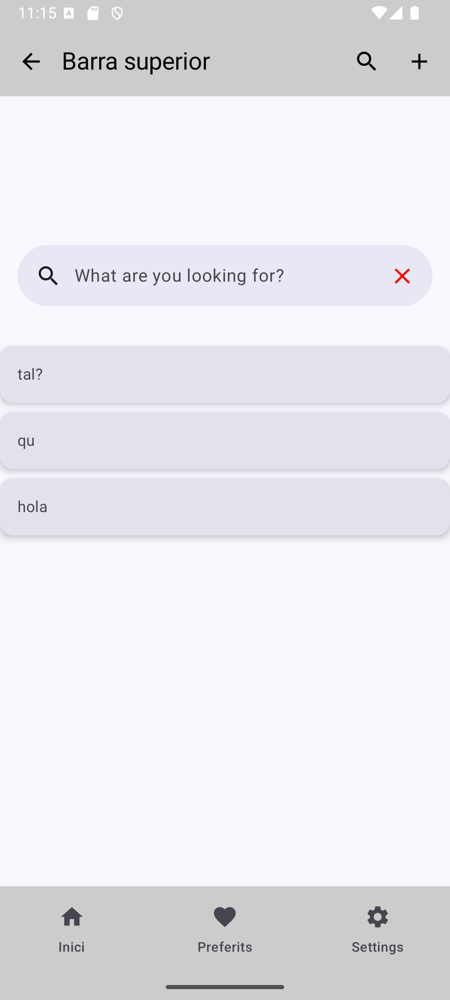

# Android App with SearchBar Composable
## Android Studio Version
Android Studio Ladybug Feature Drop | 2024.2.2

## Language
Kotlin with JetPack Compose

## Purpose
This purpose of the **main** branch is a demo of **Scaffold**, **TopBar**, **BottomBar** Composables.

---

# Gradle dependencies
If you want to expand the current project and include MVVM pattern, which is already in place through the packages, it is necessary to add the following dependencies in the file [`app/build.gradle.kts`](app/build.gradle.kts):

``` bash
dependencies {
    //This dependency provides the core components for using LiveData, ViewModel, and other lifecycle-aware components in your Android app. It's essential for implementing the MVVM architecture.
    implementation("androidx.lifecycle:lifecycle-runtime-ktx:2.6.1")
    //This dependency is crucial for observing LiveData objects within your Compose UI. It provides the observeAsState() function, which allows you to convert LiveData values into Compose state, enabling your UI to automatically update when the LiveData changes. Explanation:
    implementation("androidx.compose.runtime:runtime-livedata:1.7.5")

    //Bottom Bar
    implementation("androidx.compose.material:material:1.6.1")

    //Material 3
    implementation ("androidx.compose.material3:material3:1.2.0-alpha02")
}
```

# Screenshot
## main branch:

